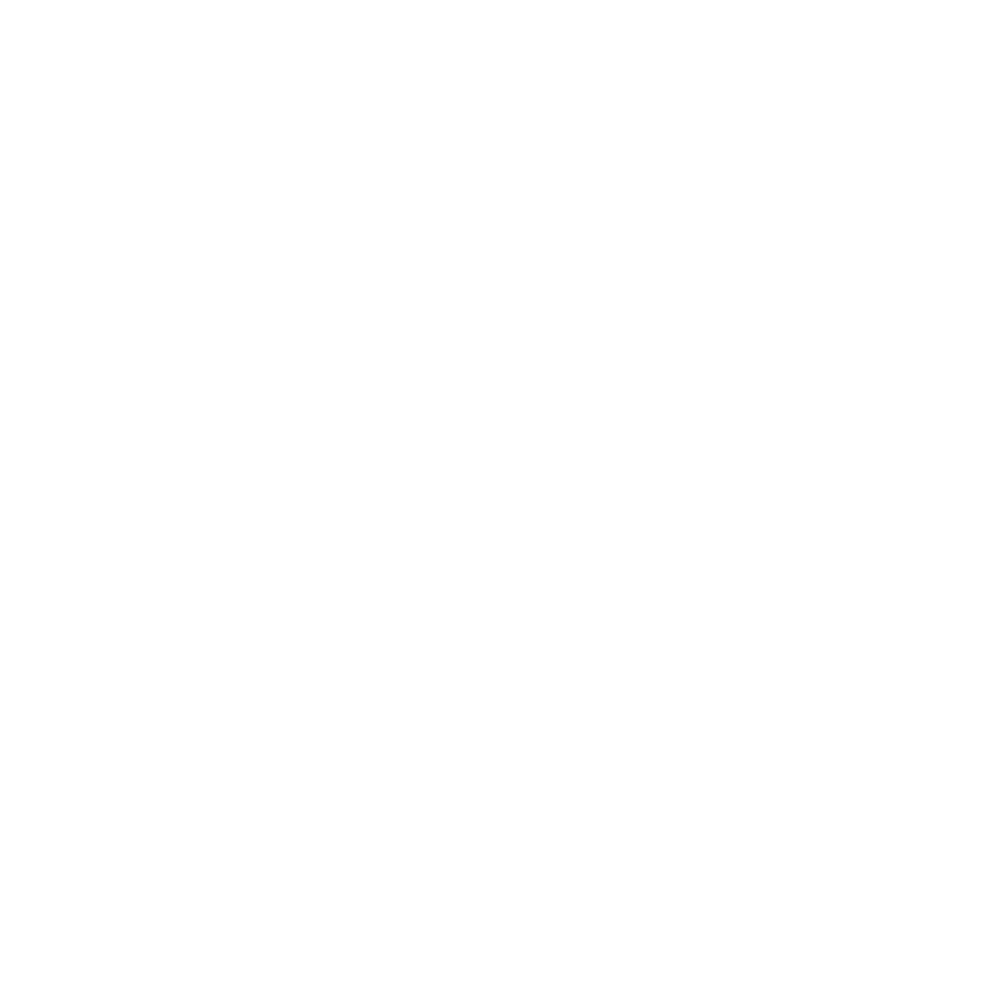

  
  
  
  <h1>Awesome Readme Template</h1>
  
  

    An awesome README template for your projects! 
  

  

<h1 align="center">Hi 👋, I'm Fatimah Almohaimeed</h1>
<h3 align="center">A software developer from Saudi Arabia</h3>

- 🌱 I’m currently learning **All about full stack developer**

- 📫 How to reach me **Fatima.almohaimeed@gmail.com**

<h3 align="left">Connect with me:</h3>

 
- 
 
- 

 <h3 align="left">Programming Languages: </h3>
 
- Python 
- Javascript
- Java
- C# 

 <h3 align="left">Frameworks:</h3> 
 
- Django
- Express
- Spring
- MERN Stack

  
  
  
  
  
  
  
 
  
  
  
   
  
   
  
   
   

<h3 align="left">Languages and Tools:</h3>

                        

 

